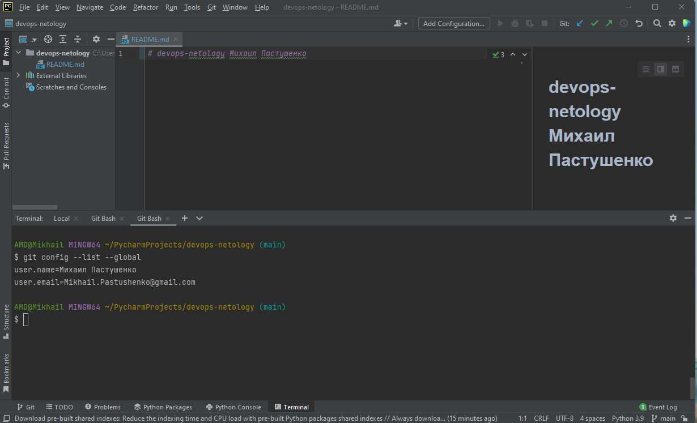
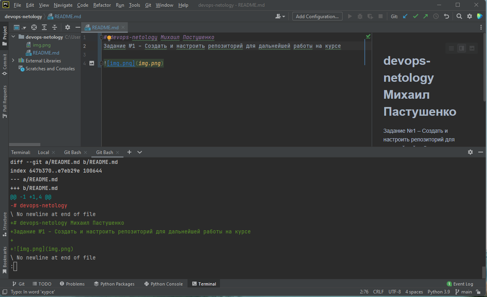
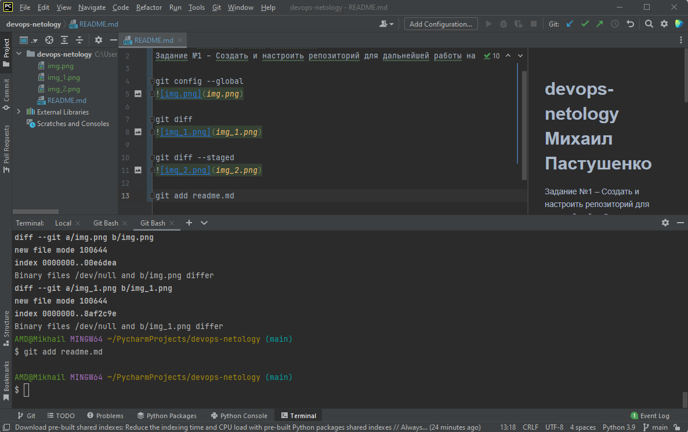
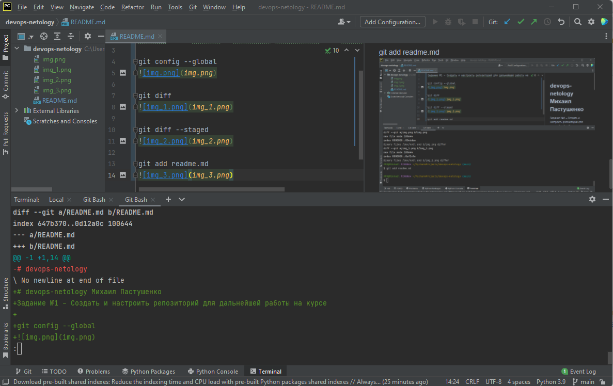
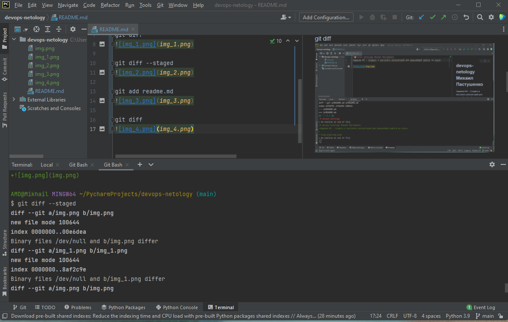

# devops-netology Михаил Пастушенко
Задание №1 – Создать и настроить репозиторий для дальнейшей работы на курсе

git config --global

git diff

git diff --staged

git add readme.md

git diff

git diff --staged
