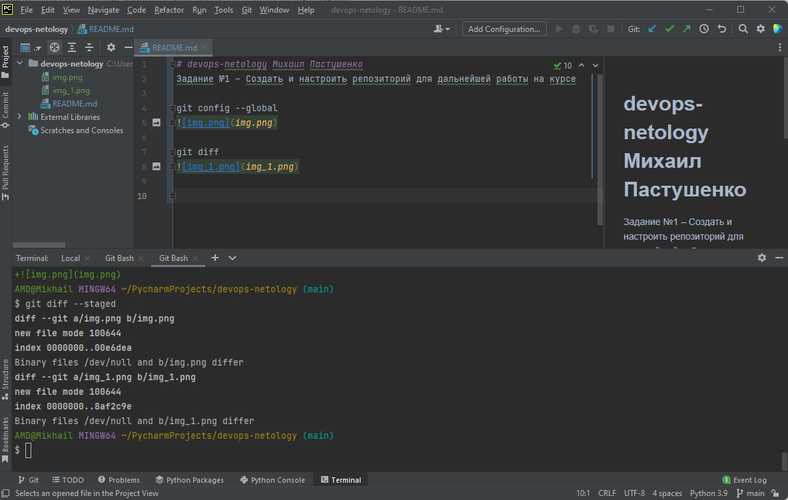

# devops-netology Михаил Пастушенко
Задание №1 – Создать и настроить репозиторий для дальнейшей работы на курсе

git config --global

git diff

git diff --staged

git add readme.md

git diff

git diff --staged

git commit -m "First commit"

git diff --staged

в каталоге Terraform, благодаря файлу .gitignore, будут проигнорированы
1) все файлы из подкаталогов ./terraform/ на любом уровне вложенности
2) файлы, включающие .tfstate
3) файлы с раширениями .log, .tfvars, .tfvars.json, _override.tf, _override.tf.json
4) файлы override.tf , override.tf.json, .terraformrc, terraform.rc

Ветка fix из задания "2.2. Основы Git"